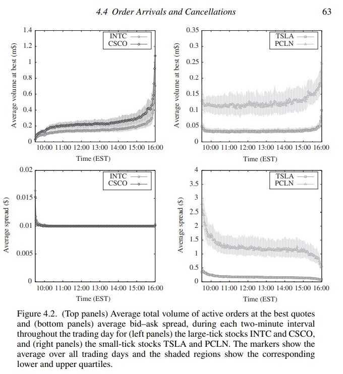

# Empirical Properties of Limit Order Books

In this chapter, we present some up-to-date statistical results regarding order flow and LOB state for a collection of stocks that we study throughout the book:
1. PCLN Priceline Group Inc.
2. TSLA Tesla Motors Inc.
3. CSCO Cisco Systems Inc.
4. INTC Intel Corp.

CSCO and INTC are large-tick stocks (with a spread close to the minimum value $s\approx \theta$). PCLN and TSLA are small-tick stocks (with a spread much larger than the tick $s>>\theta$)

Some common and notable features should be highlighted:
1. The daily turnover is of the order of 0.5%. This result in face holds across a wide selection of international stocks. This number has roughly doubled from 1995 to 2015（换手率长期保持稳定在 0.5%）
2. The total volume displayed in the LOB within 1% of the mid-price is between 1% and 3% of the daily traded volume（显示在 LOB 的 在 mid-price 1% 附近的 total volume 会在 daily traded volume 的 1% - 3%）
3. The activity at the best quotes takes place at a sub-second time scale (sometimes miliseconds), with much more activity for large-tick stocks than for small-tick stocks. This reflects the importance of queue position for large-tick stocks（最佳报价撮合的时间问题，大票和小票的区别）
4. The number of trade-through market orders (i.e. orders that match at several different prices and therefor walk up the order book) is on the order of a few percent for small-tick stocks and a few per thousand for large-tick stocks（订单被拆分成不同价格的price，对于小票来说，这种order所占比例大概是小几个百分点，对于大票来说时小几个千分点）

Intra-day Patterns
1. Market Activity（可以简单地认为成交量即可），LO limit order, MO market order
2. Spread Distribution
    1. Large-tick stocks, distribution is peaked at the minimum
    2. Small-tick stocks, the distribution is wider
    3. Spread Distribution can be measured in several different ways, such as at random instants in calendar time,
     at random instants in event-time, immediately before a transaction
    4. 如果看 spread distibution 比较： 每笔交易发生之前 和 在任意时间的话，前者会让 spread 更 narrow。解释是：liquidity takers（主动挂单的人）会更谨慎的选择盘口的 spread 获取更好的利润 
3. Order Arrivals and Cancellations
4. Order Size Distributions
5. Volume at the best Quotes
6. Volume Profiles 价格量分布顾名思义是显示指定时间段内指定价格水平的交易活动，也被称为 volume by price
7. Tick-Size Effects
8. Tick and Spread
9. Tick and Volume at Best
10. Tick and Volume of Trades

Take-home messages:
1. At any instant of the time, the total volume in an LOB is a small fraction of the corresponding daily traded volume
2. When measured over a suitably long time horizon, all market statistics are approximately symmetric between buys and sells
3. Many market quantities present a strong average daily profile: volumes and activity exhibit a J-shaped pattern, with most activity happening close to the open and close of the market, whereas the spread undergoes a steep decrease after the open, then decreases more gradually throughout the remainder of the day
4. For large-ticks stocks, the spread is almost always equal to one tick, Small-tick stocks show a broader distributioon of spread values
5. Most activity takes place close to or inside the spread. This is partly due to the fact that traders have little incentive to display publicly their trading intentions long in advance
6. The size distributions of limit orders, market orders and best queue volumes have heavy tails

